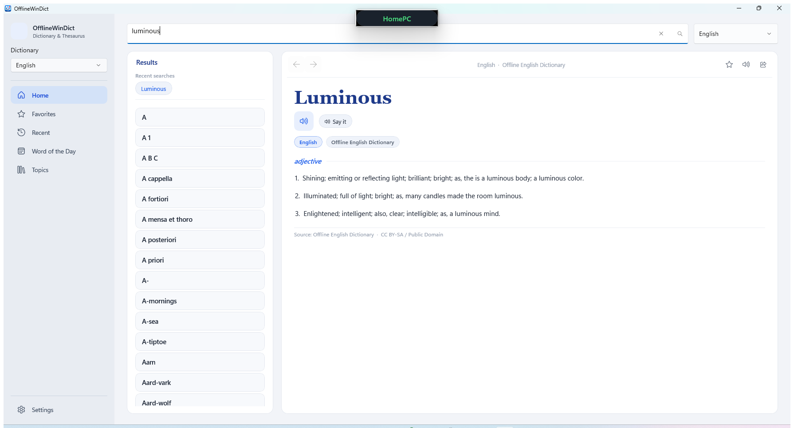

<div align="center">

# 📖 OfflineWinDict

**A fast, fully offline dictionary & thesaurus for Windows — 10 languages bundled, zero setup, no account, no internet required.**


[](https://github.com/uponatime2019/OfflineWinDict/releases/latest)




</div>

---

## 📥 Download & run — no install needed

1. Grab **`OfflineWinDict-vX.Y.Z-win-x64.zip`** from the [latest release](https://github.com/uponatime2019/OfflineWinDict/releases/latest) — **all 10 offline dictionaries are already bundled**
2. Right-click → **Extract All…**
3. Double-click **`OfflineWinDict.exe`** — portable, no installer, no admin rights, no .NET download required

> **First launch?** Windows SmartScreen may show *"Windows protected your PC"* because the app isn't code-signed — click **More info → Run anyway**.

## 🌍 Bundled offline dictionaries

Every language below ships inside the release zip — lookups work with the network cable pulled out:

| Language | File | Entries (approx.) | Source & license |
|---|---|---|---|
| 🇬🇧 English | `Dictionary.db` | ~176,000 | [English-Dictionary-SQLite](https://github.com/AyeshJayasekara/English-Dictionary-SQLite) — Public Domain / CC BY-SA |
| 🇪🇸 Spanish | `Dictionary_es.db` | ~22,000 | [WikDict](https://wikdict.com/) (Wiktionary data) — CC BY-SA 2.0 |
| 🇫🇷 French | `Dictionary_fr.db` | ~125,000 | WikDict (Wiktionary data) — CC BY-SA 2.0 |
| 🇩🇪 German | `Dictionary_de.db` | ~78,000 | WikDict (Wiktionary data) — CC BY-SA 2.0 |
| 🇮🇹 Italian | `Dictionary_it.db` | ~27,000 | WikDict (Wiktionary data) — CC BY-SA 2.0 |
| 🇵🇹 Portuguese | `Dictionary_pt.db` | ~13,000 | WikDict (Wiktionary data) — CC BY-SA 2.0 |
| 🇷🇺 Russian | `Dictionary_ru.db` | ~43,000 | WikDict (Wiktionary data) — CC BY-SA 2.0 |
| 🇳🇱 Dutch | `Dictionary_nl.db` | ~41,000 | WikDict (Wiktionary data) — CC BY-SA 2.0 |
| 🇨🇳 Chinese | `Dictionary_zh.db` | ~10,000 | WikDict (Wiktionary data) — CC BY-SA 2.0 |
| 🇯🇵 Japanese | `Dictionary_ja.db` | ~14,000 | WikDict (Wiktionary data) — CC BY-SA 2.0 |

Dictionaries live in `Assets/Data/` as SQLite databases with an `entries(word, wordtype, definition)` table. `HOW_TO_DOWNLOAD.txt` documents how to fetch or rebuild them.

## ✨ Features

- **🔎 Instant offline lookups** — definitions from bundled SQLite dictionaries, with as-you-type suggestions and prefix matching
- **🌐 10 languages** — switch dictionary language from the built-in selector; entries store word type and definition
- **🧠 Thesaurus tools** — spelling suggestions for near-misses and related words
- **🔊 Pronunciation** — recorded audio when available, otherwise Windows text-to-speech voices; optional auto-play
- **⭐ Favorites & 🕘 history** — save words, revisit recent lookups; persisted locally across sessions
- **📅 Word of the Day** — a deterministic daily word with an archived backlog
- **🧩 Curated topics** — browse topic-based vocabulary collections
- **📤 Share & copy** — copy formatted entries to the clipboard or open the Windows share sheet
- **🎨 Light/dark theme** — with a restore-last-page option so the app opens where you left it
- **⌨️ Launch-to-search** — start the app with a word as the argument to look it up immediately

## 🏗️ Architecture

```
OfflineWinDict/
├── App.xaml(.cs)               # Entry point, global exception logging, launch-to-search
├── AppSession.cs               # App-wide state: settings, active dictionary
├── MainWindow.xaml(.cs)        # Shell + home page: search, results, navigation
├── Views/                      # Favorites, Settings, and other pages
├── Services/
│   ├── OfflineDatabaseService  # SQLite lookups, suggestions, installed-language detection
│   ├── DictionaryService       # Dictionary catalog (language codes & names)
│   ├── ThesaurusService        # Related words and near-spelling suggestions
│   ├── PronunciationService    # Recorded audio / TTS playback
│   ├── WordOfTheDayService     # Deterministic daily word + local cache
│   ├── TopicsService           # Curated topic collections
│   ├── UserDataService         # Favorites & history persistence
│   └── ShareService            # Windows share integration
├── Helpers/                    # Logging, theming, settings persistence, path helpers
├── Models/                     # Word models, settings, dictionary catalog
└── Assets/Data/                # Bundled offline SQLite dictionaries (10 languages)
```

## 🧰 Technology stack

| Layer | Technology |
|---|---|
| UI framework | WinUI 3 (Windows App SDK 2.4) |
| Runtime | .NET 8 (`net8.0-windows10.0.19041.0`) |
| Dictionary storage | SQLite (`Microsoft.Data.Sqlite`) |
| JSON / settings | Newtonsoft.Json |
| Audio | Windows TTS + recorded pronunciation |

## 📋 Prerequisites

- Windows 10 version 1809 (build 17763) or later — Windows 11 recommended
- [.NET 8 SDK](https://dotnet.microsoft.com/download/dotnet/8.0) (for building from source)
- Visual Studio 2022 with the **WinUI application development** workload (optional, for the IDE experience)

> **Unpackaged app:** runs as a plain `.exe` — no MSIX package, no developer mode, no signing certificate required. The Windows App SDK runtime is bundled with the build.

## 🔨 Build & run

```bash
# Restore + build (x64)
dotnet build OfflineWinDict.csproj -p:Platform=x64

# Run
dotnet run --project OfflineWinDict.csproj -p:Platform=x64

# Other platforms
dotnet build OfflineWinDict.csproj -p:Platform=x86
dotnet build OfflineWinDict.csproj -p:Platform=ARM64

# Self-contained publish (x64) - includes all bundled dictionaries
dotnet publish OfflineWinDict.csproj -c Release -p:Platform=x64
```

Or open the project in Visual Studio 2022, pick **x64**, and press **F5**.

## ⌨️ Controls

| Action | How |
|---|---|
| Look up a word | Type in the search box → pick a suggestion or press Enter |
| Launch straight to a lookup | `OfflineWinDict.exe serendipity` |
| Switch dictionary language | Language selector (10 offline languages bundled) |
| Hear a word | Pronunciation button (recorded audio or TTS) |
| Save a word | ⭐ favorite toggle — revisitable in Favorites |
| Browse past lookups | Recent-search history page |
| Daily word | Word of the Day page, with archived days |
| Theme | Settings → Light / Dark |
| Share / copy an entry | Share or copy actions on the entry |

## 🗺️ Roadmap

- [ ] **More languages** — additional WikDict pairs are a build-script away
- [ ] **Full-text search across definitions** — find words by meaning, not just spelling
- [ ] **Anagrams & rhymes** — classic power-dictionary tools
- [ ] **Flashcards & quiz mode** — turn favorites into practice sessions
- [ ] **Export favorites** — CSV/JSON/Anki export
- [ ] **Inline images** — illustrative pictures for entries
- [ ] **Localization** — the UI is currently English-only

Want something on this list sooner? Open an issue (or a PR 😉) and say so — the roadmap is flexible.

## 🤝 Contributing

Contributions are **very welcome** — code, bug reports, documentation, and feature ideas all count.

- 🐛 **Found a bug?** Open an issue with your Windows version and steps to reproduce (session logs land in `%LOCALAPPDATA%\OfflineWinDict\logs`).
- 💡 **Have an idea?** Open a feature request or lobby for a roadmap item.
- 🔧 **Want to hack on it?** Fork → branch (`git checkout -b feature/my-feature`) → build with the command above → keep the existing style (nullable enabled) → open a PR describing what changed and why.

> By contributing, you agree that your contributions will be licensed under the [MIT License](LICENSE).

## 🔒 Privacy

OfflineWinDict is fully local. It has **no telemetry, no analytics, and no account system**. Favorites, history, settings, cached word-of-the-day data, and logs stay on your machine under `%LOCALAPPDATA%\OfflineWinDict`. Lookups against the bundled dictionaries never touch the network.

## 📄 License & attributions

- App code: released under the [MIT License](LICENSE).
- English dictionary data: [English-Dictionary-SQLite](https://github.com/AyeshJayasekara/English-Dictionary-SQLite) — Public Domain / CC BY-SA.
- Multilingual dictionary data: [WikDict](https://wikdict.com/) — converted from Wiktionary, licensed [CC BY-SA 2.0](https://creativecommons.org/licenses/by-sa/2.0/). Credit: WikDict by Daniel Naber.
- This project is an independent desktop dictionary app and is not affiliated with Oxford University Press; it does not include or redistribute any Oxford-branded content.

<div align="center">
  Made with ❤️ for word lovers.
</div>
